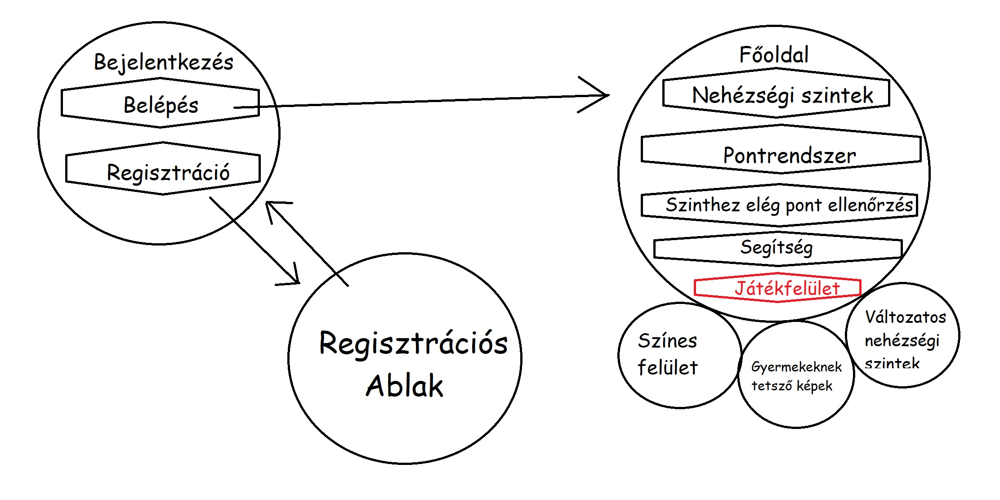
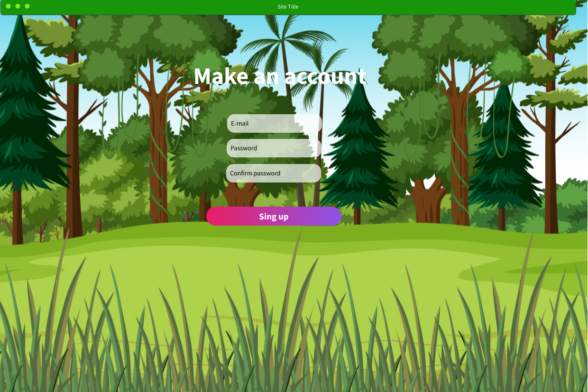
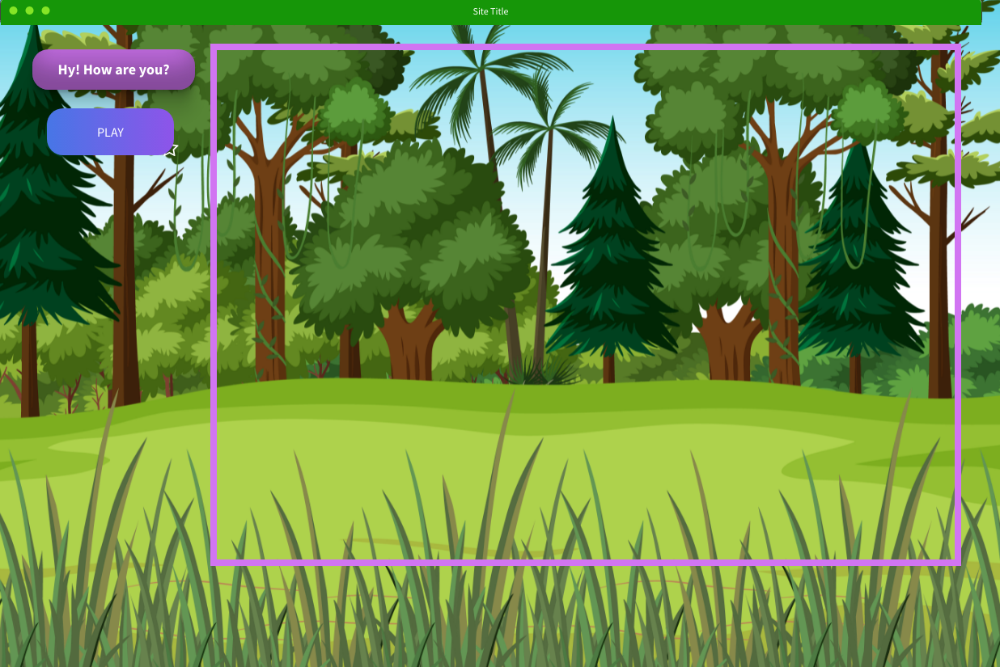
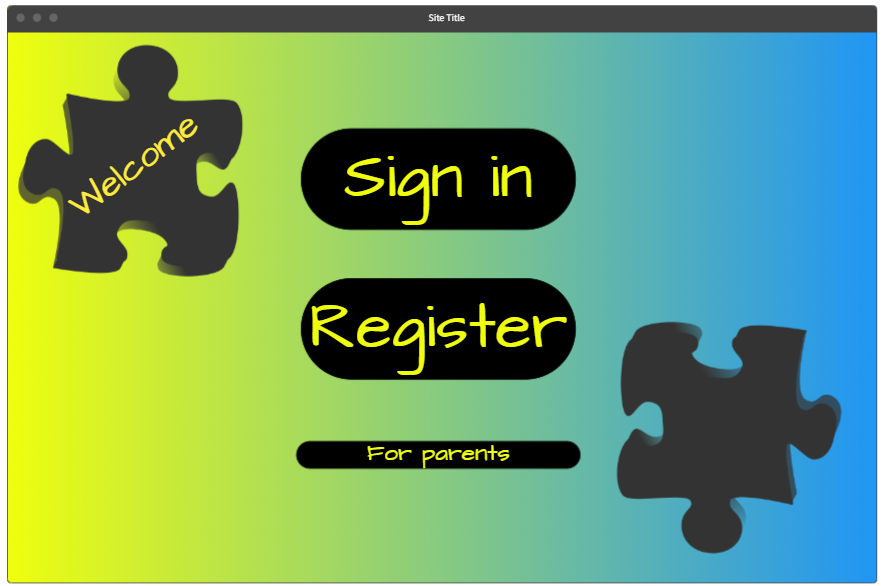
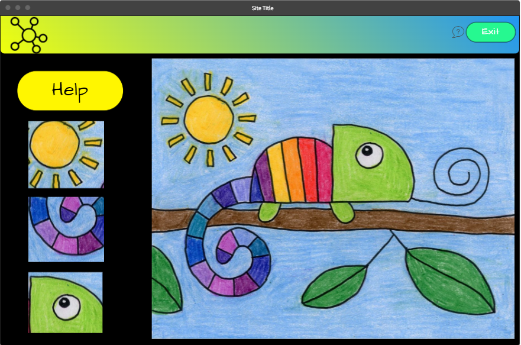

## Funkcionális specifikáció

## Rendszer céljai és nem céljai
A klasszikus kirakós játék egyaránt gyermekek és felnőttek kedvence, egyszerű és szórakoztató játék.
A rendszerünk célja, hogy egy ingyenes, digitalizált megoldást hozzon a játékhoz, mely ugyanúgy érdekelhet, és kihívást jelenthet majd minden korosztály számára.
Fontos, hogy nem szeretnénk, hogy elveszítse a játék fő érdekességeit,
ne legyen túl bonyolult, elvégre gyerekek, vagy akár idősek is játszhatják.
A kulcs összehangolni a digitalizációt az egyszerűséggel, és nem utolsó sorban, mindez ingyenes.

## Jelenlegi helyzet leírása
A gyerekek imádják a kirakós játékokat és a rajtuk lévő szép, színes képeket. Ennek darabkáit viszont könnyű elhagyni, elhajlítani, összekenni, és nehéz egy hosszabb útra magunkkal vinni. 
Tárolásuk rengeteg helyet igényel. 
Emellett egy-egy ilyen szett ára mára már az egekbe szökött, és a gyermek legfeljebb 3-4 alkalommal tudja megoldani mielőtt unalmassá válna számára. 
Így a dobozok feltornyosulnak, egy idő után már csak ide-oda pakolgatják őket, majd a szemétben végzik, ezzel is ártva a környezetünknek.
A sérülékenységük miatt is hamar "tönkre mehetnek" hiszen ki akarna egy már mázgás, szétszakadt kirakóssal játszani, vagy olyannal amiből hiányzik pár darab?

## Vágyálom rendszer leírása
A mai világban mindent képesek vagyunk digitalizálni és a jövő generációja ebben is fog felnőni.
Szerintünk fontos, hogy már gyerekkorban tisztában legyenek az új, modern eszközök használatával.
Ezért egy könnyed, szórakoztató módon szeretnénk őket bevezetni ebbe a világba.
A képkirakás a gyerekek kedvelt szórakozása, ezt digitalizálva játszva tanulhatják meg számítógép használatát.
A szülőknek pedig nem kell a szétszórt játékkal foglalkoznia.
A rendszer vagy játék weben elérhető, létre kell hozni egy felhasználói fiókot.
Több szintű, minden szinten kap a felhasználó egy képet, amit időre ki kell raknia.
Egyes szintek más-más pontot érnek, amit csillagokkal jelölünk, ezeket kell gyűjteni.
Ha nem sikerül a játékosnak elég csillagot gyűjtenie, akkor nem léphet a következő szintre.
Egy szinten maximum 3 csillagot lehet szerezni, megoldási idő függvénye, hogy hányat kap a játékos.
A rendszer fog tartalmazni egy admin felületet az adminok számára, mely által hozzáférnek a felhasználók listájához.
Tudják őket menedzselni, módosítani, törölni.
Tartalmazni fog egy játék felületet, melyen maga a játék történik.
Egy bejelentkező/regisztrációs felületet, melyen bejelentkezik vagy regisztrál a felhasználó.
Ehhez, a felhasználóval történt egyeztetés után, webes felületet fogunk használni, amit 
elérhetővé teszünk mind személyi számítógépen, mind mobileszközökön és tableteken is elérhetővé teszünk,
Android, Windows és IOS rendszereken is.

## Rendszerre vonatkozó külső megszorítások
Mivel az alkalmazás lehetőséget ad a bejelentkezésre, kezelnünk kell az e-mail címeket és a jelszavakat a **GDPR**-nak megfelelően.
A kirakós képei miatt gondolnunk kell a **Szerzői jogokra** illetve, mivel a célközönség **18 éven aluli** arról is gondoskodnunk kell, hogy a képek számukra megfelelőek, nem tartalmaznak rejtett felnőtteknek szánt tartalmakat, erőszakot, bármilyen, számukra tiltott szerek használatát nem népszerűsítik.
Emellett, mivel a felhasználók **18 éven aluliak** a felhasználási feltételeket is ennek megfelelően kell megfogalmaznunk.

## Jelenlegi üzleti folyamat modellje
A klasszikus kirakós nem használja ki, a technika nyújtotta lehetőségeket. Mivel digitalizálva könnyebb újabb és újabb feladatot előállítani, így nem kellenek polcok és unalmas sem lesz a játék közbeni tanulás.
Környezet és költségkímélő megoldás ugyanis nem kell előállítani a kirakóst, nem kellenek papírdobozok és szállítani sem kell őket, ráadásul a felhasználó számára ingyenes.
Ezen kirakósok digitalizálása lehetővé tenné hogy egy e-book-hoz hasonlóan nagy mennyiséget halmozhassunk fel, a fizikai hely
határai nélkül. Emellett a költségeket is csökkenthetné, és az előállítandó papír mennyiségét is csökkentené, ezzel csökkentve a
környezetszennyezést. A digitalizálás megakadályozná az elemek elvesztését, és kopásállóságot biztosítana, így a szavatossági időt is képes lenne megnövelni.
A kirakósok digitalizálása segíthetne a cégeknek a gyermekek által követett témák követésében, hiszens megspórolná az előállítás
és a szállítás idejét is, így szinte ugyanazon termék hamarabb is eljutna a távolabbi, vagy nehezen elérhető helyekre is. 

## Igényelt üzleti folyamatok modellje
A megrendelő azt szeretné, ha a gyermekek a bejelentkezés oldalon be tudnának jelentkezni, illetve regisztrációt kezdeményezni, melyet egy új oldalon egy form segítségével tudnának véghez vinni. 
Emellett szeretne nehézségi szinteket és ezekhez igazodó pontrendszert, illetve pontokért igényelhető segítséget.
A megrendelő igénye még, hogy a nehézségi szintek ne csak választhatóak legyenek, hanem ellenőrizzük azt is, hogy a felhasználónak van-e elég pontja a nehezebb szint megnyitásához.

## Követelménylista
|Modul        | ID |Név                    | v.|Kifejtés                              |
|-------------|----|-----------------------|---|--------------------------------------|
| Jogosultság | K1 | Bejelentkezési felület | 1.0 |A felhasználó az email címe és a jelszava segítségével bejelentkezhet. Ha a megadott e-mail cím vagy jelszó nem megfelelő, hiba üzenetet kap.|
| Jogosultság | k2 | Regisztráció |1.0| A felhasználó e-mail cím és jelszó megadásával regisztrálhat. A jelszó titkosítva és az e-mail cím az adatbázisunkban tárolásra kerül. Ha valamelyik adat ezek közül hiányzik vagy nem megfelelő, arról a felhasználó értesítést kap.
| Modifikáció | K3 | Jelszó módosítás | 1.0 | A felhasználó módosítani tudja a jelszavát, ehhez szükséges a régi és új jelszavának megadása.|
| Modifikáció | K4| Elfelejtett jelszó | 1.0 | Ha a felhasználó elfelejtette a jelszavát, ezzel az opcióval tudjuk emlékeztetni. |
| Feladattípus | K5 | Kép kirakás | 1.0 | A felhasználó kap néhány képdarabot, amiből ki kell raknia az adott képet, megadott időn belül|
| Felület | K6 | Bejelentkezés | 1.0 | A felhasználók itt tudnak belépni a rendszerbe, probléma esetén jelszót változtatni. |
| Felület | k7 | Regisztráció | 1.0 | A felhasználók ezen a felület tudnak regisztrálni. |
| Felület | K8 | Játék | 1.0 |Ezen a felületen jelennek meg a kirakandó képek |
| Felület | K9 | Profil | 1.0 |Itt látják a felhasználók az adataikat és a játékban elért szintjüket. |

## Használati esetek
ADMIN: Hozzáfér a felhasználók listájához, tudja őket menedzselni, törölni.
Jogosultsága lesz továbbá, hogy új felhasználót vegyen fel, továbbá mindenhez van joga, amihez a JÁTÉKOS szerepnek is.
JÁTÉKOS: Egy átlagos felhasználó, tud játszani, regisztrálni és módosítani a jelszavát.

## Képernyőtervek
 Trees theme: https://tinyurl.com/22wcndrv  Drawings theme:  https://tinyurl.com/2p8sh4yf

## Funkció - követelmény megfeleltetés
A bejelentkezési felülettel megvalósul a felhasználók elkülönítése, és a hitelesítés (ID: K1, K6).
A regisztráció lehetővé teszi, hogy új felhasználó kerüljön a rendszerbe (ID: K2, K7).
Ezek együttesen a jelszó módosítás, és elfelejtett jelszó funkciókkal kielégítik a JÁTÉKOS szerepkört (ID: K3, K4).
Természetesen ezekhez igényes megjelenítés, és a háttérben titkosítások társulnak,
melyeket a profil felület foglal össze (ID: K9).
A játék felületen történik a kirakók összerakása, ez a magja a programnak (ID: K5, K8).

