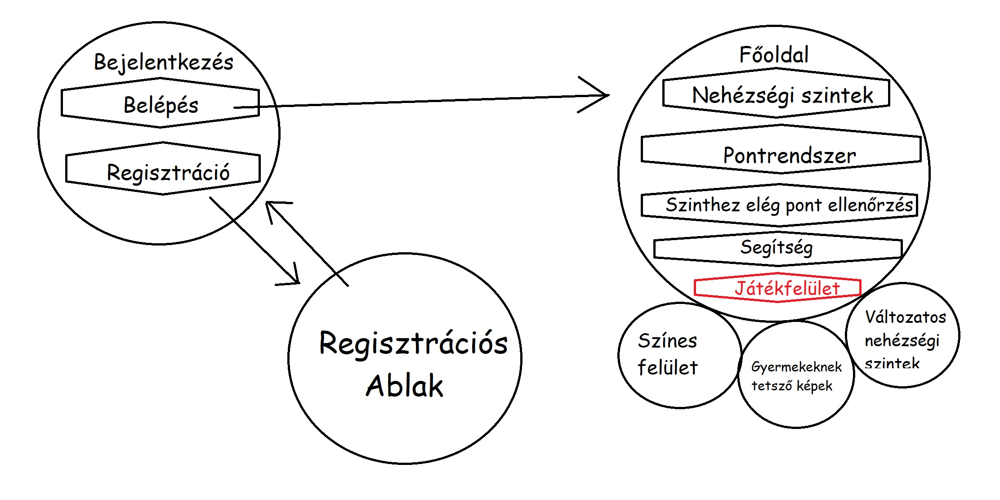

# Követelményspecifikáció

## Jelenlegi helyzet leírása
A gyerekek imádják a kirakós játékokat és a rajtuk lévő szép, színes képeket. Ennek darabkáit viszont könnyű elhagyni, elhajltani, összekenni, és nehéz egy hosszabb útra magunkkal vinni. Tárolásuk rengeteg helyet igényel. Emellett egy-egy ilyen szett ára mára már az egekbe szökött, és a gyermek legfeljett 3-4 alkalommal tudja megoldani mielőtt unalmassá válna számára. Így a dobozok feltornyosulnak, egy idő után már csak ide-oda pakolgatják őket, majd a szemétben végzik, ezzel is ártva a környezetünknek. A sérülékenységük miatt is hamar "tönkremehetnek" hiszen ki akarna egy már mázgás, szétszakadt kirakóssal játszani, vagy olyannal amiből hiányzik pár darab?

## Vágyálom rendszer leírása
A mai világban mindent képesek vagyunk digitalizálni és a jövő generációja ebben is fog felnőni.
Szerintünk fontos, hogy már gyerekkorban tisztában legyenek az új, modern eszközök használatával.
Ezért egy könnyed, szórakosztató módon szeretnénk őket bevezetni ebbe a világba.
A képkirakás a gyerekek kedvelt szórakozása, ezt dikitalizáva játszva tanulhatják meg számítógép használatát.
A szülőknem pedig nem kell a szétszórt játékkal foglalkoznia.
A rendszer vagy játék weben elérhető, létre kell hozni egy felhasználói fiókot.
Több szintű, minden szinten kap a felhasználó egy képet, amit időre ki kell raknia.
Egyes szintek más-más pontot érnek, amit csillagokkal jelölünk, ezeket kell gyűjteni.
Ha nem sikerül a játékosnak elég csillagot gyűjtenie, akkor nem léphet a következő szintre.
Egy szinten maximum 3 csillagot lehet szerezni, megoldási idő függvénye, hogy hányat kap a játékos.

## Rendszerre vonatkozó törvények, rendeletek, szabványok, ajánlások
Mivel az alkalmazás lehetőséget ad a bejelentkezésre, kezelnünk kell az e-mail címeket és a jelszvakat a **GDPR**-nak megfelelően.
A kirakós képei miatt gondolnunk kell a **Szerzői jogokra** illetve, mivel a célközönség **18 éven aluli** arról is gondoskodnunk kell, hogy a képek számukra megfelelőek, nem tartalmaznak rejtett felnőtteknek szánt tartalmakat, erőszakot, bármilyen, számukra tiltott szerek használatát nem népszerűsítik.
Emellett, mivel a felhasználók **18 éven aluliak** a felhasználási feltételeket is ennek megfelelően kell megfogalmaznunk.

## Jelenlegi üzleti folyamat modellje
A klasszikus kirakós nem használja ki, a technika nyújtotta lehetőségeket. Mivel digitalizáva könnyebb újabb és újabb feladatot előállítani, így nem kellenek polcok és unalmas sem lesz a játék közbeni tanulás. Környezet és költségkímélő megoldás ugyanis nem kell előállítani a kirakóst, nem kellenek papírdobozok és szállítani sem kell őket, ráadásul a felhasználó számárá ingyenes.

## Igényelt üzleti folyamatok modellje
A megrendelő azt szeretné ha a gyermekek a bejelentkezés oldalon be tudnának jelentkezni, illetve regisztrációt kezdeményezni, melyet egy új oldalon egy form segítségével tudnának véghez vinni. Emellett szeretne nehézségi szinteket és ezekhez igazodó pontrendszert, illetve pontokért igényelhető segítséget.A megrendelő igénye még, hogy a nehézségi szintek ne csak választhatóak legyenek, hanem ellenőrizzük azt is, hogy a felhasználónak van-e elég pontja a nehezebb szint megnyitásához.

## Követelménylista
