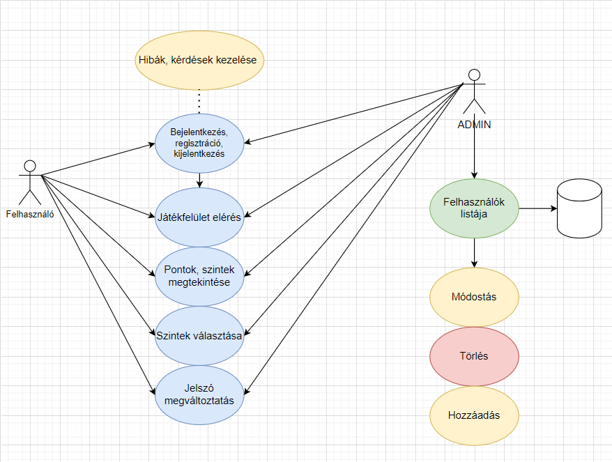
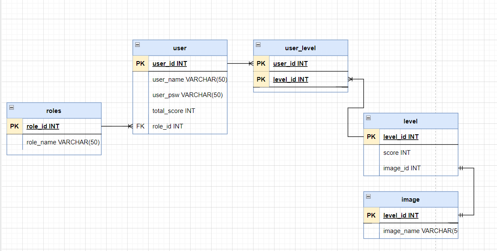

## Rendszerterv

## A rendszer célja
A klasszikus kirakós játék egyaránt gyermekek és felnőttek kedvence, egyszerű és szórakoztató játék.
A rendszerünk célja, hogy egy ingyenes, digitalizált megoldást hozzon a játékhoz, mely ugyanúgy érdekelhet, és kihívást jelenthet majd minden korosztály számára. Fontos, hogy nem szeretnénk, hogy elveszítse a játék fő érdekességeit,
ne legyen túl bonyolult, elvégre gyerekek, vagy akár idősek is játszhatják.
A kulcs összehangolni a digitalizációt az egyszerűséggel, és nem utolsó sorban, mindez ingyenes.
Egyéb célja a szép kinézet, letisztultság és egyszerűség.
Szeretnénk, ha az ember nem csak a játékban lelné örömét, hanem a játék kinézete is jó érzéssel töltené el.
A felhasználó a puzzle nehézségének megfelelően pontszámot kap, melyeknek összege az előrehaladását jelzi.
A játék webes felületen lesz elérhető, reszponzív megoldásokkal, így mobilról és tabletről is játszhatóvá szeretnénk tenni.

## Üzleti folyamatok modellje

## Követelmények
Felhasználók adatainak, előrehaladásának adatbázisban való tárolása.
Webes környezetben, reszponzívan megjelenő működés.
GDPR-nak való megfelelés.
Felnőtt tartalmak kizárása.

## Funkcionális terv
Szerepkörök: 
        - Admin
        - Felhasználó
    ADMIN:
        - Hozzáfér a felhasználók listájához, tudja őket menedzselni, adataikat módosítani, és törölni.
        - Jogosult új felhasználó felvételére
        - Jogosult mindenre amire a "Felhasználó" szerepkör is
    FELHASZNÁLÓ:
        - Tud regisztrálni
        - Meg tudja változtatni a jelszavát
        - Eléri a játékfelületet
        - Látja a pontszámait
        - Látja a nehézségi szinteket
        - Tud nehézségi szintet választani
        - Tudja használni a játékfelületet

## Fizikai környezet
Az alkalmazás webes felületre készül, mely reszponzív, tehát mobil eszközökön is jól használható.
Van tűzfal a hálózaton és minden portot is engedélyez.
Nincsenek megvásárolt komponenseink.
Fejlesztői eszközök:
                    - Visual Studio Code
                    - Visual Studio Code Live Server Extension
                    - SQLite
                    - HTML5
                    - Javascript (Pixi JS)
                    - CSS

## Architekturális terv

## Adatbázis terv

## Implementációs terv

## Tesztterv
A tesztelés célja a rendszer és a komponensek funkcionalitásának tesztelése mellett az megjelenítés tesztelése.
Szeretnénk ha az alkalmazást nem csak asztali számítógépről hanem telefon és tableten is elérhető lenne, hiszen
ezek fiatalabb felhasználók számára könnyebben elérehők. 
Emellett cél a rendszer komponenseinek vizsgálata és az üzleti logika tesztelése, ezek által megvalósított
szolgáltatások verifikálása. 

#### Tesztelési eljárások

    - Unit teszt:
        Már fejlesztés alatt szükséges tesztelnünk az üzleti logikát, a metódusok megfelelő működését.
        Ehhez UNIT teszteket használnunk, minden metódus működését meg kell vizsgálnunk, szem előtt tartva
        a minél nagyobb kódlefedettséget, illetve a szélsőséges és különleges eseteket. A metódusokat akkor
        tekinthetjük késznek ha azokra a tesztesetek hiba nélkül lefutnak
    - Alfa teszt:
        A teszt célja a meglévő funkciók elérhetőségének és kompatibilitásának tesztelése, különböző
        eszközökön, Windows, MAC és Android rendszereken illetve különböző ismert böngészőkben, így
        Google Chrome-ban Mozzila Firefox-ban és Safariban is. 
        Emellett cél az esztétikai megjelenés a reszponzivitás tesztelése, különböző méretű és elrendezésű
        eszközökön amelyeken a felhasználók potenciálisan használják majd a webalkalmazást.
        Erre asztali gépeket, Android és IOS eszközöket használunk
        Ezt a tesztet fejlesztők végzik
    - Béta teszt
        A tesztet nem fejlesztők végzik
        Tesztelendő rendszerek: Android (minimum 6.0.0), IOS, Windows 10 és 11
        Tesztelendő böngészők: Google Chrome, Mozzila Firefox és Safari
    
    A tesztről a megrendelő tesztelői csapata visszajelzőst küldhet a fejlesztőknek, amennyiben hibát 
    vagy problémát észlelnek. Ezeket a fejlesztők a lehető leghamarabb javítják és további tesztelésre átadják
    a tesztelői csapatnak. 

### Tesztelendő funkciók

#### Backend Service
Az alkalmazásnak képesnek kell lennie minden eszközön csatlakoznia a webes klienshez.
Képesnek kell lennie több klienst kiszolgálni.
Képesnek kell lennie arra, hogy az adatbázisból adatokat kérjen le, és eleget kell tennie a
megszorításnak miszerint csak a saját adatait érheti el
Képesnek kell lennie eltérő funkciók biztosítására

#### Regisztráció
A felületnek elérhetőnek kell lennie az alkalmazás kezdőoldaláról, a még nem regisztrált felhasználóknak
ide kell átirányítani, a megfelelő gomb megnyomása után. A megfelelő adatok megadása után a regisztráció 
gombra kattintva az adatoknak titkosítottan be kell kerülnie az adatbázisba, amennyiben azonos adatok nem
szerepelnek az adatbázisban. Minden e-mail címet csak egyszer lehet regisztrálni. 
Ezután elérhetővé kell tenni a felhasználó számára a belépést. Amennyiben a bejelentkezési vagy a regisztrációs 
adatok hibásak, a felhasználó hibaüzenetet kell kapjon

#### Játékfelület
A felületet minden felhasználó egyedileg el kell érje, és annak minden funkcióját használni kell tudnia.
A feladatok megoldása után új szinteknek kell elérhetővé válnia.
A feladatoknak megoldhatónak kell lenniük, amennyiben a feladat megoldottá válik a rendszernek el
kell fogadnia azt, viszont nem valós megoldásokat el kell utasítania.

#### Admin felület
Az ADMIN joggal ellátott felhasználó(k)nak képesnek kell lennie/lenniük a felhasználói lista lekérdezésére,
módosítására vagy az abban lévő elemek törlésére. Emellett minden felhasználói funkciót el kell érjenek.

## Telepítési terv

## Karbantartási terv